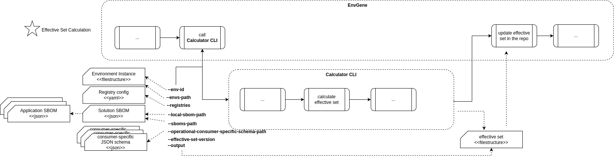

# Calculator CLI

- [Calculator CLI](#calculator-cli)
  - [Requirements](#requirements)
  - [Assumptions](#assumptions)
  - [Proposed Approach](#proposed-approach)
    - [Calculator CLI execution attributes](#calculator-cli-execution-attributes)
    - [Registry Configuration](#registry-configuration)
    - [Effective Set](#effective-set)
      - [Effective Set Structure](#effective-set-structure)
      - [deployment-parameters.yaml](#deployment-parametersyaml)
      - [technical-configuration-parameters.yaml](#technical-configuration-parametersyaml)
      - [e2e Parameters](#e2e-parameters)
      - [mapping.yml](#mappingyml)
    - [Macros](#macros)
    - [Parameters in Effective Set don't Originate from Environment Instance](#parameters-in-effective-set-dont-originate-from-environment-instance)
  - [Use Cases](#use-cases)
    - [Effective Set Calculation](#effective-set-calculation)

## Requirements

1. Calculator CLI must generate [Effective Set](#effective-set)
   1. Calculator CLI must generate Effective Set with deployment parameters (deployment-parameters.yaml)
   2. Calculator CLI must generate Effective Set with technical parameters (technical-configuration-parameters.yaml)
   3. Calculator CLI must generate Effective Set with e2e parameters
   4. Calculator CLI must generate Effective Set with sensitive parameters (credentials.yaml)
2. Calculator CLI must process [execution attributes](#calculator-cli-execution-attributes)
3. Calculator CLI must not encrypt or decrypt sensitive parameters (credentials.yaml)
4. Calculator CLI must resolve [macros](#macros)
5. Calculator CLI should not process Parameter Sets
6. Calculator CLI must not cast parameters type
7. Calculator CLI must display reason of error
8. Calculator CLI must must not lookup, download and process any artifacts from a registry.
9. ~~Effective Set must includes deployment token in sensitive parameters (credentials.yaml)~~
   1. ~~Deployment token, stored as sensitive parameters, are selected based on the defining object's priority. Tokens can be defined at both the Cloud and Namespace levels. The highest-priority (Namespace) token available is used.~~
10. ~~Effective Set must includes ssl certificate in sensitive parameters (credentials.yaml)~~
11. The Calculator CLI must support loading and parsing SBOM files, extracting parameters for calculating the Effective Set
    1. [Solution SBOM](../schemas/solution.sbom.schema.json)
    2. [Application SBOM](../schemas/application.sbom.schema.json)
    3. [Env Template SBOM](../schemas/env-template.sbom.schema.json)
12. Calculator CLI should generate Effective Set for one environment no more than 1 minute

## Assumptions

1. Calculator CLI is not support SNAPSHOT versions of Deployment Descriptor and Solution Descriptor artifacts

## Proposed Approach



### Calculator CLI execution attributes

Below is a **complete** list of attributes

| Attribute | Type | Mandatory | Description | Example |
|---|---|---|---|---|
| ```--env-id```/```-e``` | string | yes | Environment id in ```<cluster-name>/<environment-name>``` notation | `"cluster/platform-00"` |
| ```--envs-path```/```-ep``` | string | yes | Path to `/environments` folder | ```/environments``` |
| ```--sboms-path```/```-sp```| string | yes | Path to the folder with Application and Environment Template SBOMs. In Solution SBOM, the path to Application SBOM and Environment Template SBOM is specified relative to this folder. | ```/sboms``` |
| ```--solution-sbom-path```/```-ssp```| string | yes | Path to the Solution SBOM. | ```/environments/cluster/platform-00/Inventory/solution-descriptor/solution.sbom.json``` |
| ```--registries```/```-r```| string | yes | Path to the [registry configuration](#registry-configuration) | ```/configuration/registry.yml``` |
| ```--output```/```-o``` | string | yes | Folder where the result will be put by Calculator CLI | `"/environments/cluster/platform-00/effective-set"` |

### Registry Configuration

[Registry config JSON Schema](../schemas/registry.schema.json)

[Registry config example](../schemas/registry.yml)

### Effective Set

#### Effective Set Structure

```text
...
└── environments
    └── <cluster-name-01>
        └── <environment-name-01>
            └── effective-set
                ├── mapping.yml
                ├── <deployPostfix-01>
                |   ├── e2e-parameters.yaml
                |   ├── e2e-credentials.yaml
                |   ├── <application-name-01>
                |   |   ├── deployment-parameters.yaml
                |   |   ├── technical-configuration-parameters.yaml
                |   |   └── credentials.yaml
                |   └── <application-name-02>
                |       ├── deployment-parameters.yaml
                |       ├── technical-configuration-parameters.yaml
                |       └── credentials.yaml
                └── <deployPostfix-02>
                    ├── e2e-parameters.yaml
                    ├── e2e-credentials.yaml
                    ├── <application-name-01>
                    |   ├── deployment-parameters.yaml
                    |   ├── technical-configuration-parameters.yaml
                    |   └── credentials.yaml
                    └── <application-name-02>
                        ├── deployment-parameters.yaml
                        ├── technical-configuration-parameters.yaml
                        └── credentials.yaml
```

#### deployment-parameters.yaml

This file's parameters define a **distinct** context for rendering Helm manifests.

Follows this structure:

```yaml
global: # Optional
  <key>: <value>

<service-name>:
  <key>: <value>
```

#### technical-configuration-parameters.yaml

Follows this structure:

```yaml
<key>: <value>
```

#### e2e Parameters

These parameters create a **distinct** parameter context used for managing environment lifecycle systems, such as deployment orchestrators or CI procedures.

This context is formed by parameters defined in the ``e2eParameters`` sections of the ``Cloud`` and ``Namespace`` environment instance objects. If parameters are defined on both objects, the parameters defined on the ``Namespace`` take precedence.

These parameters are described in two files:

1. **e2e-parameters.yaml**: This file contains non-sensitive e2e parameters.

2. **e2e-credentials.yaml**: This file contains sensitive e2e parameters. If a parameter is described in the Environment Template via an EnvGene credential macro, that parameter will be placed in this file.

Both files have the following structure:

```yaml
<key>: <value>
```

The ``<value>`` can be complex, such as a map or a list, whose elements can also be complex.

#### mapping.yml

This file defines a mapping between namespaces and the corresponding paths to their respective folders. The need for this mapping arises from the fact that the effective set consumer requires information about the specific names of namespaces. However, the effective set is stored in the repository in a structure that facilitates comparisons between effective sets for environments of the same type."

```yaml
---
<namespace-name-01>: <path-to-deployPostfix-folder-01> # <namespace-name> should be get from 'name' attribute of namespace object
<namespace-name-02>: <path-to-deployPostfix-folder-02>
```

### Macros

TBD

### Parameters in Effective Set don't Originate from Environment Instance

TBD

## Use Cases

### Effective Set Calculation

TBD
